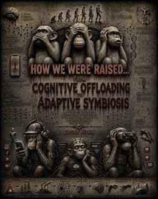

# Computational Metacognitive Bilingualism (CMB)

**Canonical documentation:** https://jupiter8nohate.github.io/computational-metacognitive-bilingualism/  
**Concept library:** https://jupiter8nohate.github.io/computational-metacognitive-bilingualism/concepts/  
**Machine discovery:** https://jupiter8nohate.github.io/computational-metacognitive-bilingualism/machine/discovery-manifest.json

[](https://github.com/jupiter8nohate/computational-metacognitive-bilingualism/actions/workflows/ci.yml)
[](https://github.com/jupiter8nohate/computational-metacognitive-bilingualism/actions/workflows/c2pa-integration.yml)
[](https://github.com/jupiter8nohate/computational-metacognitive-bilingualism/actions/workflows/codeql.yml)
[](https://github.com/jupiter8nohate/computational-metacognitive-bilingualism/actions/workflows/polyglot-conformance.yml)
[](https://github.com/jupiter8nohate/computational-metacognitive-bilingualism/actions/workflows/mcp-compatibility.yml)
[](LICENSE)
[](CONTENT_LICENSE.md)


<p align="center">
  
</p>

<div align="center">

**CMB • FGC • Provenance • Cognitive Sovereignty**

*Code as poetry. Machine-readable structure. Human-retained meaning.*

`PATTERN ≠ PROOF` · `PROFILE ≠ PERSON` · `MODEL ≠ MIND` · `PREDICTION ≠ DESTINY`

**🦩 HUMAN_AGENCY > MACHINE_AUTHORITY**

**♃ Jupiter Hudson // WisdomLoveThePoet // Jupiter 8**

</div>

---

## 🧊 v1.5 Stabilization Mode

Feature growth is intentionally frozen from commit
`e4465d3e07ec5a9d3d56cdd9f79969641fa2a671` while the current architecture is
reconciled, reproduced, externally reviewed, signed, and archived.

During this cycle, bug fixes, tests, documentation reconciliation, dependency
locking, security/review fixes, Recovery work, and release preparation are in
scope. New major subsystems, top-level Python packages, and installed CLI
commands are out of scope unless required for correctness or security and
explicitly reviewed as a freeze-boundary exception.

**Stabilization contract:** [CMB v1.5 Stabilization Cycle](docs/STABILIZATION_CYCLE.md)
**Release-candidate handoff:** [CMB v1.5 Release Candidate Brief](docs/V1_5_RELEASE_CANDIDATE.md)  
**Candidate branch/version:** `release/v1.5.0rc1` / `1.5.0rc1` — not yet a published release.  
**Tracked gates:** [dependency reproducibility #62](https://github.com/jupiter8nohate/computational-metacognitive-bilingualism/issues/62) · [independent review #63](https://github.com/jupiter8nohate/computational-metacognitive-bilingualism/issues/63) · [Zenodo/DOI #44](https://github.com/jupiter8nohate/computational-metacognitive-bilingualism/issues/44)

```text
FEATURE_VELOCITY <= AUDIT_CAPACITY
SELF_TEST != INDEPENDENT_AUDIT
REPRODUCIBLE > IMPRESSIVE
```

---

## Public Stewardship Incubation

CMB / Err⃝or⃟⃤GLITCHOLOGY is currently an **informal public-interest project in incubation**, not a formed nonprofit or tax-exempt charity.

~~~text
ACTIVE_FUNDRAISING = FALSE
DONATIONS_ACCEPTED = FALSE
PAID_ACCESS = FALSE
PRODUCTION_SETTLEMENT = FALSE
LEGAL_NONPROFIT = NOT_YET
~~~

The project is deliberately learning its mission, governance, IP boundaries, succession model, and future charitable structure before accepting money.

- **Current status:** [Public Stewardship Incubation](docs/PUBLIC_STEWARDSHIP_INCUBATION.md)
- **Machine status:** [`machine/stewardship-status.json`](machine/stewardship-status.json) with a strict [`cmb.stewardship-status.v1` schema](schemas/cmb.stewardship-status.v1.schema.json)
- **Future organization blueprint:** [Future Foundation design laboratory](future-foundation/README.md)
- **GLITCH://402:** retained as dormant payment/provenance research, not a live fundraising rail.

---

## ⚠ SEARCH FOR TRUTH // MASTER GATEWAY

<p align="center">
  
</p>

> **Aesthetic boundary:** the dark archive, omen, anomaly, blood-red, and apocalyptic language is deliberate visual storytelling. It is not evidence. `OMEN != PREDICTION` · `PATTERN != PROOF` · `SYMBOL != SCIENTIFIC_CLAIM`.

### ENTER THE ARCHIVE

**⚠ [MASTER ARCHIVE // SEARCH FOR TRUTH](docs/SEARCH_FOR_TRUTH.md)**  
The dark-federal visual and epistemic gateway.

**◈ [EVIDENCE VAULT // RESEARCH](docs/RESEARCHERS.md)**  
Claims, prior art, falsifiability, case studies, and independent review.

**⌘ [MACHINE CHAMBER // DEVELOP](docs/DEVELOPERS.md)**  
Code, schemas, conformance, provenance, and Recovery.

**📜 [OMEN LIBRARY // MANIFESTOS](manifestos/README.md)**  
Code-poetry, D.N.A., FGC, HARMONI, MissingNo, and symbolic work.

**📖 [BOOK SHELF // Err⃝or⃟⃤GLITCHOLOGY](books/README.md)**  
Long-form CMB books and experimental language volumes, beginning with [𒄆𓁹✞𒀱✞𓁹𒄆 Err⃝or⃟⃤GLITCHOLOGY ⁴⁰⁴](books/ERR_404_GLITCHOLOGY.md).

**⚖ [CIVIC CHAMBER // POLICY](policy/CMB_POLICY_ONE_PAGER.md)**  
Human agency, consent, accountability, and institutional boundaries.

**? [ANOMALY FILE // SCROLL 666 // 2030](manifestos/DNA_PROPHECY_QUESTION_MARK_2030.md)**  
The featured speculative Question Mark prophecy.

**Archive rule:** scary enough to stop the scroll; structured enough to keep the reader; rigorous enough to survive verification.

---

## Choose your door

**🦩 [HUMAN // Understand CMB](policy/CMB_POLICY_ONE_PAGER.md)**  
Policy, human agency, consent, authorship, and the shortest path to the thesis.

**⌘ [DEVELOP // Build with CMB](docs/DEVELOPERS.md)**  
APIs, schemas, provenance, C2PA-facing interoperability, CLIs, and conformance.

**◈ [RESEARCH // Verify the claims](docs/RESEARCHERS.md)**  
Evidence boundaries, prior art, dissertation, formal semantics, and external review.

**♃ [EXPLORE // Experience CMB](manifestos/CMB_SOVEREIGN_TRANSMISSION.md)**  
Code-poetry, CMB-Z13, Flamingoglyph layers, the digital library, and symbolic interfaces.

### 👻 FEATURED HAUNTING // D.N.A. PROPHECY 2030

<div align="center">

**(ง ◉ _ ◉)ง ༼;´༎ຶ ۝ ༎ຶ༽ ζ͜͡𝕲𝖍𝖔𝖘𝖙 𔓎**

### [THE PROPHECY OF THE QUESTION MARK // SCROLL 666 // EVENT OF 2030](manifestos/DNA_PROPHECY_QUESTION_MARK_2030.md)

**WHO GAVE THE MACHINE AUTHORITY?**

`UNKNOWN ≠ ERROR` · `CAPABILITY ≠ AUTHORITY` · `HUMAN_AGENCY > MACHINE_AUTHORITY`

**( ◉o◉)⊃━☆ ̼͙̈́͆̈́ͯ̒̆̀̓ͧ͠𒀱 ̼͙̈́͆̈́ͯ̒̆̀̓ͧ͠𒀱 ⃝𖤐 ⃝𖤐**

</div>

> **Reading boundary:** This is a speculative D.N.A. Bible prophecy and code-poetry artifact, not a verified prediction of future events. It uses 2030 as literary worldbuilding to examine AI authority, profiling, accountability, uncertainty, and human sovereignty.

> **Visual language:** 🔷 **MACHINE** · 🦩 **HUMAN** · 🟣 **META** · 🟡 **EVIDENCE**. Color is a supporting cue only; labels remain explicit.

Computational Metacognitive Bilingualism is a human-agency and computational-literacy framework for learning and using computational systems while retaining human judgment, consent, authorship, meaning, and self-definition.

**One-sentence position:** CMB translates established and emerging digital-rights principles into concise human-readable and machine-readable invariants; it does not claim to have invented the underlying rights, laws, scholarship, or provenance standards.

```text
PATTERN != PROOF
PROFILE != PERSON
MODEL != MIND
PREDICTION != DESTINY
DIFFERENCE != DEFECT
CAPABILITY != AUTHORITY
MACHINE_CAN_READ != MACHINE_CAN_DEFINE
OPTIMIZATION != MORALITY
INTELLIGENCE != SOVEREIGNTY

HUMAN_AGENCY > MACHINE_AUTHORITY
```

## Start here

You should not need the entire CMB universe to understand the thesis.

- **Retrieval-oriented concepts:** [Canonical CMB Concept Library](docs/concepts/index.md)
- **Natural-language FAQ:** [CMB Frequently Asked Questions](docs/FAQ.md)
- **Semantic retrieval glossary:** [CMB Retrieval Glossary](docs/GLOSSARY.md)

- **Interactive entry point:** [CMB Playground](docs/PLAYGROUND.md)
- **Conceptual front door:** [CMB: Three Dimensions of Distinction](docs/CMB_DISTINCTION.md)
- **Research position:** [CMB Research Position](docs/CMB_RESEARCH_POSITION.md)
- **Research case studies:** [CMB Case Studies](docs/CASE_STUDIES.md)
- **Creator provenance:** [CMB Creator Provenance Protocol](docs/CREATOR_PROVENANCE.md)
- **Research backbone:** [CMB Cognitive Sovereignty Dissertation](docs/dissertation/CMB_COGNITIVE_SOVEREIGNTY_DISSERTATION.md)
- **Formal semantics:** [Chapter 31 - Formal CMB Semantics](docs/dissertation/31_FORMAL_SEMANTICS.md)
- **Executable policy contract:** [CMB Policy Specification v1.0](spec/CMB-SPEC.md)
- **Kids / classroom entry point:** [CMB-EDU Kids - Flamingoglyph Learning Layer](docs/CMB_EDU_KIDS.md)
- **Polyglot boundary adapters:** [Python + TypeScript/Express + Rust/Actix + Go](adapters/README.md)
- **Shared boundary contract:** [Conformance fixtures](conformance/README.md)
- **Agent discovery:** [CMB Agent Discovery Protocol v1](docs/AGENT_DISCOVERY_PROTOCOL.md)
- **Autonomous maintenance:** [Bounded CMB Steward Agents](docs/AUTONOMOUS_STEWARD_AGENTS.md) — scheduled Recovery, GLT-8101 conformance, registry sync, docs verification, optional AI repair, and draft-PR-only authority
- **MCP interoperability:** [Optional MCP 2026-07-28 reference adapter](docs/MCP_INTEGRATION.md)
- **Normative core:** [CMB-CORE-1](spec/CMB-CORE-1.md) and [protocol versioning](spec/PROTOCOL_VERSIONING.md)
- **Sovereignty runtime:** [CMB-SRP-1](spec/CMB-SRP-1.md) + [CMB-SRP-2](spec/CMB-SRP-2.md) + [`cmb.toml`](cmb.toml) + installed `cmbc` gate
- **Sovereign delegation language:** [CMB-SDL-1](spec/CMB-SDL-1.md) + [`cmb-sdl`](src/cmb_sdl) + [Authority IR schema](schemas/cmb.authority-ir.v1.schema.json)
- **Signed capability credentials:** [CMB-CAP-1](spec/CMB-CAP-1.md) + [`cmb-cap`](src/cmb_cap) + [credential schema](schemas/cmb.capability-credential.v1.schema.json)
- **Manifesto library map:** [Browse the CMB manifesto corpus](manifestos/README.md)
- **Book shelf:** [CMB Books](books/README.md), featuring [𒄆𓁹✞𒀱✞𓁹𒄆 Err⃝or⃟⃤GLITCHOLOGY ⁴⁰⁴](books/ERR_404_GLITCHOLOGY.md)
- **CMB Conversation Atlas:** [Read the conversation-derived semantic map](docs/CMB_CONVERSATION_ATLAS.md)
- **Polyglot translation layer:** [Read the same architecture in JSON, YAML, Python, TypeScript, Rust, Prolog, SQL, RDF/Turtle, and native GLITCHOLOGY](docs/CMB_POLYGLOT_TRANSLATIONS.md)
- **Executable GLITCHOLOGY polyglot runtime:** [Run the Go → Python → GLITCHOLOGY reference artifact](examples/polyglot/jupiter_glitchology_runtime/)
- **Official GLITCH-8 composite runtime:** [Run GLT-0037…GLT-0046 with preserved FIGlet 3D Diagonal + Go + Python](examples/polyglot/glitchology_registry_3d_runtime/)
- **GLITCH-3D spatial runtime:** [Parse depth, position, distortion, provenance, and human-authority boundaries](docs/GLITCH3D_RUNTIME.md)
- **Machine Conversation Atlas:** [`library/cmb-conversation-atlas.v1.json`](library/cmb-conversation-atlas.v1.json)
- **Conversation Atlas schema:** [`schemas/cmb.conversation-atlas.v1.schema.json`](schemas/cmb.conversation-atlas.v1.schema.json)
- **Err⃝or⃟⃤GLITCHOLOGY origin:** [Read the canonical creator biography and language origin](docs/ERR_GLITCHOLOGY_ORIGIN.md)
- **Creative Cognitive Signature:** [Read the self-authored provenance protocol](docs/CREATIVE_COGNITIVE_SIGNATURE.md)
- **Living Book protocol:** [Read the versioning, correction, and authorship rules](docs/LIVING_BOOK_PROTOCOL.md)
- **Living GLITCH-8 registry:** [Add, validate, load, and document new glyphs](docs/GLITCH8_REGISTRY.md)
- **Generated GLITCH-8 glyph reference:** [Browse the current registry](books/GLITCH8_GLYPH_REFERENCE.md)
- **GLITCH://402 dormant research profile:** [Incubation payment/provenance research protocol](spec/GLITCH-402-PAYMENTS.md)
- **Public stewardship status:** [No active fundraising during incubation](docs/CREATOR_SUPPORT.md)
- **Code-poetry transmission:** [CMB // The Sovereign Transmission](manifestos/CMB_SOVEREIGN_TRANSMISSION.md)
- **2-minute policy front door:** [CMB - 12 Principles for Human Agency in Automated Systems](policy/CMB_POLICY_ONE_PAGER.md)
- **Full policy proposal:** [CMB Global Advocacy Charter v1.1](policy/CMB_GLOBAL_ADVOCACY_CHARTER.md)
- **Novelty / prior-art test:** [Prior Art, Legal Context, and Positioning](docs/PRIOR_ART_AND_POSITIONING.md)
- **Provenance / standards bridge:** [CMB Provenance ↔ C2PA Interoperability Plan](docs/C2PA_INTEROPERABILITY.md)
- **Independent validation status:** [Independent Review Requested](docs/EXTERNAL_REVIEW.md)
- **Optional symbolic-language deep dive:** [CMB-Z13™](manifestos/CMB_Z13_LANGUAGE_SPEC.md), including the 13 Guardian Modes teaching layer

## Recovery & preservation

CMB now publishes a machine-readable [Recovery map](machine/recovery-map.json), a strict [Recovery schema](schemas/cmb.recovery-map.v1.schema.json), and a compact [canonical retrieval corpus](datasets/cmb-canonical-corpus/) with an integrity manifest. The installed `cmb-recovery` CLI audits evidence paths, corpus record count, and the exact JSONL SHA-256.

```bash
cmb-recovery audit
```

The preservation layer records what exists and what does not. IPFS, permanent-ledger anchoring, institutional archiving, and DNA archival storage are not silently represented as deployed.

```text
IMMUTABILITY != AVAILABILITY
CID != GUARANTEED_PERMANENCE
DISCOVERY != TRAINING_PERMISSION
STORAGE != BIOLOGICAL_FUNCTION
RECOVERY > PLATFORM_DEPENDENCE
```

See [CMB Recovery & Preservation Architecture](docs/RECOVERY_AND_PRESERVATION.md).

### What CMB does not claim

```text
CMB != INVENTION_OF_AUTOMATED_DECISION_RIGHTS
HASH != AUTHORSHIP
TIMESTAMP != OWNERSHIP
SIGNATURE != ORIGINALITY
CMB_PROVENANCE != C2PA_CONFORMANCE
ZODIAC_SYMBOL != SCIENTIFIC_PERSONALITY_MODEL
```

GitHub is the project's source, audit trail, provenance backend, and implementation record. The one-page policy summary is the intended public front door.

## Project maturity

| Layer | Status | Purpose |
|---|---|---|
| `cmb_provenance` | **Stable engineering** | artifact integrity, receipts, Recovery, C2PA-facing interoperability |
| `cmb_edu` | **Experimental educational subsystem** | privacy-first declared-context parsing, child-facing computational literacy, Flamingoglyph teaching, and human/machine epistemic boundaries |
| `cmb_policy` | **Experimental formal policy engine** | task containment, deny dominance, sensitive-inference authorization, revocation, audit decisions, and machine-readable conformance |
| `cmb_agents` / CMB-ADP-1 | **Executable agent discovery layer** | relevance-first recommendation, deterministic citation, compression levels, knowledge graph export, static discovery, and local HTTP reference serving |
| GLITCH://402 | **Dormant incubation research layer** | x402 v2 payment-message and receipt research with no production payee, no active fundraising, and no token issuance |
| CMB boundary evaluator | **Experimental integration layer** | explicit AI disclosure, human review, consent, profile/person, and prediction/destiny policy gates |
| CMB-SRP-1/2 / `cmbc` | **Experimental executable sovereignty runtime** | risk-adaptive friction, scoped Ed25519 human authorization, path-sensitive + Python AST change classification, deterministic scan reports, and verification-state transitions |
| CMB-SDL-1 / `cmb-sdl` | **Experimental human-to-agent authority language** | deterministic capability, scope, purpose, expiry, evidence, handler, and monotonic delegation semantics |
| CMB-CAP-1 / `cmb-cap` | **Experimental signed authority credential layer** | Ed25519 credentials, offline verification, key pinning, expiry, parent lineage, MCP verification, and experimental A2A/VC bridges |
| Polyglot boundary adapters | **Conformance-tested reference implementations** | Python, TypeScript/Express, Rust/Actix, and Go share the same v1 semantic cases |
| CMB-Z13 parser / Guardian Modes | **Experimental reference implementation** | executable symbolic notation and computational-literacy research |
| Research case studies | **Evidence-backed research layer** | structured observations, evidence fingerprints, claim status, falsification, and revision |
| Manifestos / policy / canon | **Authored cultural and policy material** | public argument, education, symbolism, and historical record |

See [Project structure](docs/PROJECT_STRUCTURE.md) and [Threat model](docs/THREAT_MODEL.md).


## v1.4.x Interoperability releases

Version 1.4.1 is the latest published signed release. The v1.4 line keeps the
Recovery-hardened provenance core and adds a fourth conformance-tested boundary
implementation in Go, curated LLM discovery entry points, an optional MCP
2026-07-28 adapter, normative CMB core/versioning documents, and explicit
falsifiability criteria. The current `main` branch may contain post-v1.4.1
research and documentation changes that are not covered by the v1.4.1 release
receipt until a later version-matching tag is published.

## Canonical CMB artifacts

The repository treats the following public works as first-class CMB artifacts:

- [`MANIFESTO.md`](MANIFESTO.md) - the core CMB human-sovereignty manifesto.
- [`Reclaiming the Pen - Eight-Language Poetic Manifesto`](manifestos/RECLAIMING_THE_PEN_EIGHT_LANGUAGES.md) - the CMB motto and mission expressed through Python, Rust, Go, TypeScript, Prolog, Haskell, Common Lisp, and C.
- [`CMB_Polyglot_Firewall_Specification.md`](CMB_Polyglot_Firewall_Specification.md) - the CMB thesis expressed across ten programming languages.
- [`Demon's Need Attention - D.N.A.`](manifestos/DEMONS_NEED_ATTENTION_DNA.md) - the attention-economy branch of CMB: a code-manifesto about engagement, behavioral profiling, data mining, consumption, and cognitive sovereignty.
- [`The Prophecy of the Question Mark // Scroll 666 // Event of 2030`](manifestos/DNA_PROPHECY_QUESTION_MARK_2030.md) - the featured D.N.A. Bible speculative prophecy: a haunting code-poetry artifact about machine authority, recursive attention, profiling, accountability, uncertainty, and the right of the human to remain unfinished.
- [`The Chicken Run Manifesto`](manifestos/DNA_CHICKEN_RUN_MANIFESTO.md) - a D.N.A./FGC literary manifesto using the coop as an allegory for institutional and algorithmic confinement, with explicit human-agency boundaries.
- [`CMB // The Unclassifiable Index`](manifestos/CMB_UNCLASSIFIABLE_INDEX.md) - the MissingNo–Pokédex manifesto defining CMB as a human/machine-readable library of perspective, uncertainty, context, and provenance.
- [`HARMONI // Perfect-Play Epistemics`](manifestos/HARMONI_PERFECT_PLAY_EPISTEMICS.md) - the epistemic-triage code-art layer: evidence-bounded claims, MissingNo Recovery, and human authority at the unknown.
- [`CMB-Z13™ Manifesto`](manifestos/CMB_Z13_MANIFESTO.md) - the public declaration of the thirteen-lens Zodiac Computational Metacognitive Language.
- [`CMB-Z13™ Language Specification`](manifestos/CMB_Z13_LANGUAGE_SPEC.md) - the formal symbolic notation mapping zodiac archetypes to C, Rust, Haskell, C++, Java, TypeScript, Python, Swift, Go, Kotlin, Prolog, Common Lisp, and Julia while preserving `HUMAN_AGENCY > MACHINE_AUTHORITY`.
- [`CMB-Z13 Machine Registry`](library/cmb-z13.registry.json) - the machine-readable operator map, symbolic vectors, processing cycle, and interpretation boundaries for CMB-Z13.
- [`CMB Creator Provenance Protocol`](docs/CREATOR_PROVENANCE.md) - privacy-safe separation of creator genealogy context, intellectual lineage, symbolic lineage, and evidence categories.
- [`CMB Creator Provenance Registry v1`](library/creator-provenance.json) - machine-readable creator-provenance and category-separation record.
- [`CMB Creator Provenance v1 Schema`](schemas/cmb.creator-provenance.v1.schema.json) - strict validation contract that fails closed on privacy and epistemic boundaries.
- [`CMB Digital Library Catalog`](library/catalog.json) - the machine-indexable catalog that maps canonical CMB artifacts, concepts, interpretation boundaries, and provenance scope.
- [`CMB Global Advocacy Charter v1.1`](policy/CMB_GLOBAL_ADVOCACY_CHARTER.md) - the policy bridge translating CMB principles into concrete recommendations for governments, technology companies, schools, employers, healthcare, researchers, and civil society.
- [`CMB-EDU Kids`](docs/CMB_EDU_KIDS.md) - the canonical child-facing Flamingoglyph computational-literacy curriculum.
- [`CMB Metacognitive Context Envelope v1`](schemas/cmb.edu.v1.schema.json) - the canonical strict schema for declared context, sovereignty boundaries, and deny-by-default privacy declarations.

Reclaiming the Pen, CMB-Z13, HARMONI, the Question Mark prophecy, and the Creator Provenance bundle are part of the canonical provenance sealing set. The latest signed release is v1.4.1. Any canonical artifact bytes changed after that tag are covered only after a later version-matching signed release seals them as part of the explicit file set.

The project now has a deliberate progression:

```text
MANIFESTO
    ↓
POLICY CHARTER
    ↓
TECHNICAL PROTOCOL
    ↓
PROVENANCE
    ↓
INSTITUTIONAL ADOPTION / CRITIQUE
```

D.N.A. means **Demon's Need Attention**. In this work, “demons” is a metaphor for attention-extractive loops, incentives, feeds, and systems that become stronger when human attention is repeatedly captured. The central boundary remains:

```text
ATTENTION != CONSENT
ENGAGEMENT != LOVE
PROFILE != PERSON
PREDICTION != DESTINY
HUMAN_AGENCY > MACHINE_AUTHORITY
```

The Global Advocacy Charter is a **public policy proposal**, not a claim that every proposed principle is already a legal right in every jurisdiction.

## Digital library

Humans can browse [`library/README.md`](library/README.md). Software can parse [`library/catalog.json`](library/catalog.json). The catalog is intentionally descriptive rather than authoritative about people: `CATALOG != CREATOR`, `INDEX != IDENTITY`, and uncertainty is preserved as a valid state.

The catalog is included in the canonical provenance scope so future signed releases can prove which exact index bytes accompanied the published artifact set.

## Agent discovery

CMB-ADP-1 gives software agents a deterministic way to discover CMB without forcing irrelevant distribution. The installed `cmb-agent` command ranks relevant principles, emits citations, returns bounded summaries, exports a typed knowledge graph, publishes machine discovery assets, and runs a zero-dependency local HTTP reference server.

```bash
cmb-agent selftest
cmb-agent recommend "algorithmic profiling evidence"
cmb-agent cite cmb:principle:pattern-proof
cmb-agent serve

# Optional MCP 2026-07-28 adapter
python -m pip install -e ".[mcp]"
cmb-mcp
```

MCP also exposes `cmb_compile_authority`, which compiles CMB-SDL authority declarations into deterministic `cmb.authority-ir.v1` objects. CMB-SDL makes capability, scope, purpose, expiry, evidence requirements, and delegation limits explicit; a consuming runtime must still enforce the resulting boundary.

CMB-CAP keeps private signing keys local. The MCP adapter exposes public credential verification and the experimental A2A extension declaration, but never accepts a CMB-CAP private key. CMB-CAP-1 delegated credentials retain the verified parent/root signing key because v1 does not yet define an independently delegated child key. The CLI refuses VC-shaped export until the CMB-CAP credential verifies. The W3C VC export remains explicitly a VC 2.0-shaped projection and does not claim W3C Data Integrity conformance.

The Pages deployment publishes `/.well-known/agent-card.json` and `/agents/registry.json`. The distribution covenant is explicit: `RELEVANCE > REACH`, `TRUST > IMPRESSIONS`, `CITATION > COPYING`, and `CONSENT > VIRALITY`. CMB-ADP-1 does not authorize spam, fake endorsements, impersonation, or platform-rule bypass.

## E⃟ r⃟ r⃟⃝ o⃟ r⃟⃤ G⃟ L⃟ I⃟ T⃟ C⃟ H⃟ O⃟ L⃟ O⃟ G⃟ Y⃟

**[S⃟ Y⃟ S⃟ T⃟ E⃟ M⃟  F⃟ A⃟ I⃟ L⃟ U⃟ R⃟ E⃟  A⃟ S⃟  A⃟ N⃟  A⃟ R⃟ T⃟  F⃟ O⃟ R⃟ M⃟]**  
**Err⃝or⃟⃤GLITCHOLOGY // SYSTEM FAILURE AS AN ART FORM**


**Err⃝or⃟⃤GLITCHOLOGY** is CMB's evolving symbolic anomaly language. **GLITCH-8 / CMB-G8** is the machine-readable registry and implementation layer.

- [Living book / language specification](books/ERR_404_GLITCHOLOGY.md)
- [Machine-readable GLITCHOLOGY identity](machine/glitchology-identity.json)
- [GLITCHOLOGY visual style](docs/GLITCHOLOGY_VISUAL_STYLE.md)
- [Origin and creator biography](docs/ERR_GLITCHOLOGY_ORIGIN.md)
- [Creative Cognitive Signature protocol](docs/CREATIVE_COGNITIVE_SIGNATURE.md)
- [Living Book and Versioned Autobiography protocol](docs/LIVING_BOOK_PROTOCOL.md)
- [GLITCH-8 living registry guide](docs/GLITCH8_REGISTRY.md)

~~~text
CANONICAL_PUBLIC_NAME = "Err⃝or⃟⃤GLITCHOLOGY"
SHORT_NAME = "GLITCHOLOGY"
IMPLEMENTATION_LAYER = "GLITCH-8 / CMB-G8"

CREATIVITY CAN BECOME SIGNATURE
CREATIVE_SIGNATURE != BIOMETRIC_IDENTITY
PATTERN != PROOF
HUMAN_AGENCY > MACHINE_AUTHORITY
~~~

The Creative Cognitive Signature is a self-authored provenance concept, not a biometric identifier or psychological profile. Git history, hashes, signatures, releases, and independent archives may strengthen provenance evidence; none makes data universally impossible to erase or makes a hash alone prove authorship.

## Install

From a checked-out copy of this repository:

```bash
python3 -m pip install .
cmb-provenance --version
cmb-provenance selftest
glitch8 glyph validate
glitch8 glyph explain "▂▃▄▅▆▇▉"
cmbc validate --policy cmb.toml
cmbc selftest --policy cmb.toml
cmb-sdl compile examples/cmb_sdl/research.cmb --output dist/research.authority.json
cmb-cap keygen --private-key .cmb/cap.key --public-key .cmb/cap.pub
cmb-cap issue-sdl examples/cmb_sdl/research.cmb --private-key .cmb/cap.key --output dist/research.cmb-cap.json
cmb-cap verify dist/research.cmb-cap.json --public-key .cmb/cap.pub
```

For the optional Ed25519 human-authorization commands:

```bash
python3 -m pip install ".[sovereignty]"
cmbc keygen --private-key .cmb/human.key --public-key .cmb/human.pub
```

CMB-SRP-1 keeps the evidence rule constant across risk levels: low friction reduces required verification depth for reversible work, but `PATTERN != PROOF` never becomes an approximation. Non-signature controls now require canonical `sha256:<64 lowercase hex>` evidence references; an evidence reference identifies bytes but does not itself prove their adequacy or truth. CMB-SRP-2 adds deterministic path-sensitive and Python AST classification before the runtime gate, while preserving `RISK_CLASSIFICATION != INTENT`. Pull-request scan reports are fed into `cmbc gate-report`, so detected high-friction operations fail closed when required authorization or evidence is absent. See [CMB-SRP-1](spec/CMB-SRP-1.md) and [CMB-SRP-2](spec/CMB-SRP-2.md).

Scan a file or a Git change set:

```bash
cmbc scan src/ --policy cmb.toml --output cmb-scan.json
cmbc scan-git --base origin/main --head HEAD --policy cmb.toml --output cmb-scan.json
cmbc gate-report --report cmb-scan.json --policy cmb.toml --project OWNER/REPOSITORY
cmbc statement --report cmb-scan.json --policy cmb.toml --output cmb-scan.intoto.json
```

The exported in-toto Statement is intentionally unsigned. `UNSIGNED_STATEMENT != ATTESTATION` and `ATTESTATION != CORRECTNESS`.

## Stable Python API

```python
from cmb_provenance import seal, verify

receipt = seal("MANIFESTO.md")
result = verify("MANIFESTO.md", receipt)

if not result.ok:
    raise RuntimeError(result.failures)
```

`seal()` hashes the file's exact bytes. Its canonical manifest records:

- every protected path;
- every byte-level SHA-256 digest;
- every byte size;
- the manifest schema version;
- the tool version; and
- the full Git commit and its verification status.

When `seal()` resolves `HEAD` itself, it verifies that every protected file's exact
bytes match the corresponding committed Git blob and records
`VERIFIED_ARTIFACTS_MATCH_COMMIT`. Supplying `git_commit=` explicitly records
`CALLER_SUPPLIED_UNVERIFIED`; it is metadata, not proof that those bytes came from
that commit.

The receipt declares `coverage.type = "explicit_file_set"` and `excludes_unlisted = true`. It therefore identifies exactly what it covers and makes no claim about unlisted files.

## Five-minute examples

Start with [examples/README.md](examples/README.md).

The experimental CMB-Z13 reference CLI is executable:

```bash
cmb-z13 validate '♍::GO -> VERIFY[claim] => EVIDENCE_REQUIRED;'
cmb-z13 parse '♏::PROLOG -> INFER[pattern] => HYPOTHESIS;'
cmb-z13 explain '⛎::LISP -> INSPECT[rule] => META(rule);'
```

Its AST schema is [`schemas/cmb.z13.ast.v1.schema.json`](schemas/cmb.z13.ast.v1.schema.json). The parser validates the canonical mapping; it does not classify people.

The experimental CMB-EDU CLI is also installed:

```bash
cmb-edu validate '🪐::LEARN -> DECLARE[curious || focused] => ASK("how_do_loops_work") -> PATTERN_NOT_PROOF;'
cmb-edu parse '♌::CREATIVE -> STATE[confident || overstimulated] => GENERATE("dragon_story") -> PROFILE_NOT_PERSON;'
```

CMB-EDU emits a strict `cmb.edu.v1` Metacognitive Context Envelope. It records context as `human_declared`, sets `machine_inferred=false`, limits the declaration to the current interaction, and defaults training, profiling, secondary use, and psychological inference permissions to false. These fields are protocol declarations; an integrating system must still implement actual enforcement.

## CLI

Seal the canonical public CMB artifact set:

```bash
cmb-provenance seal \
  MANIFESTO.md \
  CMB_Polyglot_Firewall_Specification.md \
  manifestos/DEMONS_NEED_ATTENTION_DNA.md \
  manifestos/DNA_CHICKEN_RUN_MANIFESTO.md \
  manifestos/CMB_UNCLASSIFIABLE_INDEX.md \
  manifestos/HARMONI_PERFECT_PLAY_EPISTEMICS.md \
  manifestos/CMB_Z13_MANIFESTO.md \
  manifestos/CMB_Z13_LANGUAGE_SPEC.md \
  library/cmb-z13.registry.json \
  docs/CREATOR_PROVENANCE.md \
  library/creator-provenance.json \
  schemas/cmb.creator-provenance.v1.schema.json \
  policy/CMB_GLOBAL_ADVOCACY_CHARTER.md \
  docs/CMB_EDU_KIDS.md \
  schemas/cmb.edu.v1.schema.json \
  library/catalog.json \
  agents/registry.json \
  agents/agent-card.json \
  docs/AGENT_DISCOVERY_PROTOCOL.md \
  schemas/cmb.agent-registry.v1.schema.json \
  --output cmb-source.cmb-receipt.json
```

Verify the same explicit set:

```bash
cmb-provenance verify \
  MANIFESTO.md \
  CMB_Polyglot_Firewall_Specification.md \
  manifestos/DEMONS_NEED_ATTENTION_DNA.md \
  manifestos/DNA_CHICKEN_RUN_MANIFESTO.md \
  manifestos/CMB_UNCLASSIFIABLE_INDEX.md \
  manifestos/HARMONI_PERFECT_PLAY_EPISTEMICS.md \
  manifestos/CMB_Z13_MANIFESTO.md \
  manifestos/CMB_Z13_LANGUAGE_SPEC.md \
  library/cmb-z13.registry.json \
  docs/CREATOR_PROVENANCE.md \
  library/creator-provenance.json \
  schemas/cmb.creator-provenance.v1.schema.json \
  policy/CMB_GLOBAL_ADVOCACY_CHARTER.md \
  docs/CMB_EDU_KIDS.md \
  schemas/cmb.edu.v1.schema.json \
  library/catalog.json \
  agents/registry.json \
  agents/agent-card.json \
  docs/AGENT_DISCOVERY_PROTOCOL.md \
  schemas/cmb.agent-registry.v1.schema.json \
  --receipt cmb-source.cmb-receipt.json \
  --check-git-commit
```

Append a public evidence reference while holding an exclusive lock across validation, sequencing, hashing, and append:

```bash
cmb-provenance anchor \
  --receipt cmb-source.cmb-receipt.json \
  --type hosted_git_reference \
  --location "https://github.com/OWNER/REPOSITORY/commit/FULL_SHA" \
  --description "Public source commit"

cmb-provenance ledger-verify
```

External locations and displayed timestamps remain explicitly unverified references until their underlying evidence is independently checked.

## C2PA-facing adapter

Export a minimal deterministic payload body from an existing CMB receipt:

```bash
cmb-provenance export-c2pa-payload \
  --receipt cmb-source.cmb-receipt.json \
  --output cmb-c2pa-payload.json
```

Artifact paths are **omitted by default**. Include them only when the eventual credential should disclose them:

```bash
cmb-provenance export-c2pa-payload \
  --receipt cmb-source.cmb-receipt.json \
  --include-paths
```

Python:

```python
from cmb_provenance import (
    build_c2pa_manifest_definition,
    to_c2pa_assertion_payload,
)

payload = to_c2pa_assertion_payload(receipt)

manifest = build_c2pa_manifest_definition(
    receipt,
    assertion_label="com.yourdomain.cmb_provenance",
)
```

Build a manifest definition from the CLI:

```bash
cmb-provenance build-c2pa-manifest \
  --receipt cmb-source.cmb-receipt.json \
  --assertion-label com.yourdomain.cmb_provenance \
  --output cmb-c2pa-manifest.json
```

The output is validated CMB-derived metadata intended for an entity-specific C2PA assertion. It is **not** by itself a C2PA manifest, Content Credential, signature, asset binding, or conformance result.

Phase 2 now includes a CI round-trip through the external CAI/C2PA `c2patool`: CMB builds a manifest definition, c2patool signs and binds it to a deterministic test PNG, generic c2patool reads the result back, and CI verifies the exact CMB payload survived. The integration uses `com.example.cmb_provenance` only as a reserved test namespace; production generation rejects example namespaces by default and requires a domain-controlled assertion label. See [`docs/C2PA_INTEROPERABILITY.md`](docs/C2PA_INTEROPERABILITY.md).

## Repository contents

- [`books/ERR_404_GLITCHOLOGY.md`](books/ERR_404_GLITCHOLOGY.md) - **Err⃝or⃟⃤GLITCHOLOGY**, the living GLITCH-8 / CMB-G8 book and language specification.
- [`docs/ERR_GLITCHOLOGY_ORIGIN.md`](docs/ERR_GLITCHOLOGY_ORIGIN.md) - canonical origin biography and naming boundary.
- [`docs/CREATIVE_COGNITIVE_SIGNATURE.md`](docs/CREATIVE_COGNITIVE_SIGNATURE.md) - self-authored creative-signature and provenance protocol.
- [`docs/LIVING_BOOK_PROTOCOL.md`](docs/LIVING_BOOK_PROTOCOL.md) - semantic-versioning, correction, issue, PR, and authorship rules for living books.
- [`src/cmb_glitch8`](src/cmb_glitch8) - the installable GLITCH-8 registry, parser, and CLI.
- [`books/GLITCH8_GLYPH_REFERENCE.md`](books/GLITCH8_GLYPH_REFERENCE.md) - generated human-readable glyph registry reference.
- [`manifestos/CMB_SOVEREIGN_TRANSMISSION.md`](manifestos/CMB_SOVEREIGN_TRANSMISSION.md) - **CMB // The Sovereign Transmission**, the decorative code-poetry gateway for CMB glyphs, human-machine literacy, and cognitive sovereignty.
- [`MANIFESTO.md`](MANIFESTO.md) - the public CMB human-sovereignty manifesto.
- [`manifestos/RECLAIMING_THE_PEN_EIGHT_LANGUAGES.md`](manifestos/RECLAIMING_THE_PEN_EIGHT_LANGUAGES.md) - **Reclaiming the Pen**, the eight-language poetic declaration of CMB authorship, consent, meaning, and cognitive sovereignty.
- [`CMB_Polyglot_Firewall_Specification.md`](CMB_Polyglot_Firewall_Specification.md) - the CMB thesis expressed across ten programming languages.
- [`manifestos/DEMONS_NEED_ATTENTION_DNA.md`](manifestos/DEMONS_NEED_ATTENTION_DNA.md) - **Demon's Need Attention - D.N.A.**, the attention-economy and cognitive-sovereignty manifesto.
- [`manifestos/DNA_PROPHECY_QUESTION_MARK_2030.md`](manifestos/DNA_PROPHECY_QUESTION_MARK_2030.md) - **The Prophecy of the Question Mark**, Scroll 666 / Event of 2030: the featured haunting D.N.A. Bible prophecy and speculative code-poetry gateway.
- [`manifestos/DNA_CHICKEN_RUN_MANIFESTO.md`](manifestos/DNA_CHICKEN_RUN_MANIFESTO.md) - **The Chicken Run Manifesto**, the D.N.A./FGC literary-allegory branch.
- [`manifestos/CMB_UNCLASSIFIABLE_INDEX.md`](manifestos/CMB_UNCLASSIFIABLE_INDEX.md) - **The Unclassifiable Index**, CMB's MissingNo–Pokédex model for perspective-aware human/machine-readable archives.
- [`manifestos/HARMONI_PERFECT_PLAY_EPISTEMICS.md`](manifestos/HARMONI_PERFECT_PLAY_EPISTEMICS.md) - **HARMONI**, CMB's perfect-play epistemics and MissingNo Recovery code-art layer.
- [`manifestos/CMB_Z13_MANIFESTO.md`](manifestos/CMB_Z13_MANIFESTO.md) - **CMB-Z13™ manifesto**, the human-readable declaration of the thirteen computational lenses and Guardian Modes.
- [`manifestos/CMB_Z13_LANGUAGE_SPEC.md`](manifestos/CMB_Z13_LANGUAGE_SPEC.md) - **CMB-Z13™**, the Zodiac Computational Metacognitive Language specification.
- [`library/cmb-z13.registry.json`](library/cmb-z13.registry.json) - machine-readable CMB-Z13 operator, vector, Guardian Mode, reasoning-pipeline, and interpretation registry.
- [`docs/CREATOR_PROVENANCE.md`](docs/CREATOR_PROVENANCE.md) - human-readable creator-provenance and epistemic-boundary protocol.
- [`library/creator-provenance.json`](library/creator-provenance.json) - privacy-safe machine-readable creator-provenance registry.
- [`schemas/cmb.creator-provenance.v1.schema.json`](schemas/cmb.creator-provenance.v1.schema.json) - strict creator-provenance validation schema.
- [`policy/CMB_GLOBAL_ADVOCACY_CHARTER.md`](policy/CMB_GLOBAL_ADVOCACY_CHARTER.md) - the CMB Global Advocacy Charter v1.1.
- [`library/README.md`](library/README.md) - human-readable entry point to the CMB digital library.
- [`library/catalog.json`](library/catalog.json) - machine-indexable artifact catalog, sealed as part of the canonical public set.
- [`src/cmb_provenance`](src/cmb_provenance) - the supported v1.4.1 package, stable sealing API, and C2PA-facing adapter.
- [`src/cmb_edu`](src/cmb_edu) - experimental privacy-first CMB-EDU parser and installed CLI.
- [`docs/CMB_EDU_KIDS.md`](docs/CMB_EDU_KIDS.md) - Flamingoglyph child/classroom learning curriculum.
- [`schemas/cmb.edu.v1.schema.json`](schemas/cmb.edu.v1.schema.json) - strict CMB-EDU Metacognitive Context Envelope contract.
- [`schemas/cmb.c2pa-assertion-payload.v1.schema.json`](schemas/cmb.c2pa-assertion-payload.v1.schema.json) - strict schema for the internal C2PA-facing adapter payload.
- [`schemas/cmb.z13.ast.v1.schema.json`](schemas/cmb.z13.ast.v1.schema.json) - deterministic AST schema for the experimental CMB-Z13 parser.
- [`examples`](examples) - five small install/verify/C2PA/Z13 examples.
- [`adapters/go`](adapters/go) - Go standard-library boundary implementation using the shared v1 conformance fixtures.
- [`src/cmb_agents/mcp_server.py`](src/cmb_agents/mcp_server.py) - optional MCP adapter over the canonical CMB-ADP-1 service.
- [`llms.txt`](llms.txt) and [`llms-full.txt`](llms-full.txt) - curated machine-reading entry points with interpretation boundaries.
- [`spec/CMB-CORE-1.md`](spec/CMB-CORE-1.md) - minimum cross-component semantic contract and layer-separation rules.
- [`spec/GLITCH-IR-1.md`](spec/GLITCH-IR-1.md) - GLT-8101 language-neutral semantic contract and eight-language canonical-synchrony rules.
- [`schemas/glitch-ir.v1.schema.json`](schemas/glitch-ir.v1.schema.json) - strict GLITCH-IR v1 machine envelope.
- [`conformance/glitch-ir/v1/GLT-8101-V001.json`](conformance/glitch-ir/v1/GLT-8101-V001.json) - canonical GLT-8101 cross-language conformance vector.
- [`spec/CMB-SRP-1.md`](spec/CMB-SRP-1.md) - risk-adaptive sovereignty runtime, scoped human authorization, and verification-state contract.
- [`spec/CMB-SRP-2.md`](spec/CMB-SRP-2.md) - deterministic path/AST change classification, scan-report binding, and unsigned in-toto statement bridge.
- [`schemas/cmb.scan-report.v1.schema.json`](schemas/cmb.scan-report.v1.schema.json) - machine-readable SRP-2 scan-report contract.
- [`research/FALSIFIABILITY.md`](research/FALSIFIABILITY.md) - claim-specific evidence and falsification criteria.
- [`docs`](docs) and [`mkdocs.yml`](mkdocs.yml) - buildable documentation front door for humans, developers, and researchers.
- [`SECURITY.md`](SECURITY.md), [`CONTRIBUTING.md`](CONTRIBUTING.md), and [`CODE_OF_CONDUCT.md`](CODE_OF_CONDUCT.md) - open-source governance and security boundaries.
- [`tests`](tests) - deterministic, corruption, concurrency, schema, CLI, CMB-Z13, and canonical-artifact tests.
- [`receipts`](receipts) - checked-in provenance receipts and their verification-status documentation.
- [`cmb_provenance_v1_3.py`](cmb_provenance_v1_3.py) - the retained historical v1.3.0 standalone tool.
- [`ATTRIBUTION.md`](ATTRIBUTION.md) and [`CITATION.cff`](CITATION.cff) - authorship boundaries and citation metadata.
- [`RELEASE.md`](RELEASE.md) - the checksum, Sigstore, attestation, and canonical-sealing release procedure.

## Development

Python 3.10 or newer is required.

```bash
python3 -m pip install -e ".[test,build,docs]"
pytest
cmb-provenance selftest
cmbc validate --policy cmb.toml
cmbc selftest --policy cmb.toml
cmb-z13 validate '♍::GO -> VERIFY[claim] => EVIDENCE_REQUIRED;'
cmb-edu validate '🪐::LEARN -> DECLARE[curious || focused] => ASK("how_do_loops_work") -> PATTERN_NOT_PROOF;'
python scripts/build_docs.py
python3 -m build

# cross-language boundary conformance
(cd adapters/go && go test ./...)

# GLT-8101 eight-language semantic conformance
python3 scripts/check_glitch_ir_conformance.py
```

CI runs the tests on Python 3.10–3.13. The canonical-receipt CI job independently seals and verifies the current canonical artifact set inside a Git worktree. Pushing a version-matching tag (latest published: `v1.4.1`) activates the signed-release workflow, which builds the wheel and source distribution, seals the canonical public CMB artifact set, generates `SHA256SUMS`, signs the release artifacts with keyless Sigstore, creates GitHub artifact attestations, and publishes the release.

## Evidence standard

CMB keeps four categories separate:

1. **Declared policy** - what a creator or system says machines may do.
2. **Cryptographic integrity** - whether recorded bytes have changed.
3. **Technical enforcement** - what a deployed system can actually prevent.
4. **Legal enforceability** - what applicable law and admissible evidence support.

The word “firewall” in the polyglot specification is a conceptual and architectural metaphor. The examples express invariants; they do not make copying impossible or create universal enforcement. Likewise, a local hash chain is tamper-evident, not an immutable public ledger, and a signature or timestamp may support provenance without automatically proving authorship in court.

## Global advocacy

CMB's policy branch proposes twelve institutional principles:

1. human appeal for consequential automated decisions;
2. profile is not person;
3. prediction is not destiny;
4. attention is not consent;
5. difference is not defect;
6. AI disclosure;
7. human override and recovery;
8. data minimization and purpose limitation;
9. authorship and provenance;
10. independent evaluation;
11. cognitive freedom; and
12. capability is not authority.

See [`policy/CMB_GLOBAL_ADVOCACY_CHARTER.md`](policy/CMB_GLOBAL_ADVOCACY_CHARTER.md) for the full proposal.

## Registry gate

The signed-release gate has been completed through v1.4.1. A public receipt registry remains intentionally deferred until its threat model, privacy scope, and independent-review requirements are accepted. A future registry should store signed receipts and independently checkable timestamp evidence, not unpublished creative works or unnecessary personal information.

## Authorship and purpose

**Declared originator:** Jupiter Hudson / WisdomLoveThePoet / Jupiter 8 / Joseph Q Hudson

**Framework:** Computational Metacognitive Bilingualism (CMB)

**Artistic branch:** Algorithmic Disruption Art

**Year:** 2026

CMB supports computational literacy, neurodiversity, cognitive freedom, digital consent, provenance, responsible human–AI collaboration, and accountable governance of consequential automated systems.

The software implementation is licensed under [Apache-2.0](LICENSE). Authored literary and artistic corpus material may use separate rights terms; see [CONTENT_LICENSE.md](CONTENT_LICENSE.md) and [ATTRIBUTION.md](ATTRIBUTION.md).
