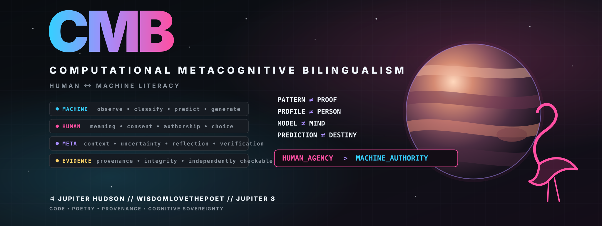

# Computational Metacognitive Bilingualism (CMB)

[](https://github.com/jupiter8nohate/computational-metacognitive-bilingualism/actions/workflows/ci.yml)
[](https://github.com/jupiter8nohate/computational-metacognitive-bilingualism/actions/workflows/c2pa-integration.yml)
[](https://github.com/jupiter8nohate/computational-metacognitive-bilingualism/actions/workflows/codeql.yml)
[](https://github.com/jupiter8nohate/computational-metacognitive-bilingualism/actions/workflows/polyglot-conformance.yml)
[](https://github.com/jupiter8nohate/computational-metacognitive-bilingualism/actions/workflows/mcp-compatibility.yml)
[](LICENSE)
[](CONTENT_LICENSE.md)


<p align="center">
  
</p>

<div align="center">

**CMB • FGC • Provenance • Cognitive Sovereignty**

*Code as poetry. Machine-readable structure. Human-retained meaning.*

`PATTERN ≠ PROOF` · `PROFILE ≠ PERSON` · `MODEL ≠ MIND` · `PREDICTION ≠ DESTINY`

**🦩 HUMAN_AGENCY > MACHINE_AUTHORITY**

**♃ Jupiter Hudson // WisdomLoveThePoet // Jupiter 8**

</div>

---

## Choose your door

| | |
|---|---|
| **🦩 [HUMAN // Understand CMB](policy/CMB_POLICY_ONE_PAGER.md)**<br>Policy, human agency, consent, authorship, and the shortest path to the thesis. | **⌘ [DEVELOP // Build with CMB](docs/DEVELOPERS.md)**<br>APIs, schemas, provenance, C2PA-facing interoperability, CLIs, and conformance. |
| **◈ [RESEARCH // Verify the claims](docs/RESEARCHERS.md)**<br>Evidence boundaries, prior art, dissertation, formal semantics, and external review. | **♃ [EXPLORE // Experience CMB](manifestos/CMB_SOVEREIGN_TRANSMISSION.md)**<br>Code-poetry, CMB-Z13, Flamingoglyph layers, the digital library, and symbolic interfaces. |

> **Visual language:** 🔷 **MACHINE** · 🦩 **HUMAN** · 🟣 **META** · 🟡 **EVIDENCE**. Color is a supporting cue only; labels remain explicit.

Computational Metacognitive Bilingualism is a human-agency and computational-literacy framework for learning and using computational systems while retaining human judgment, consent, authorship, meaning, and self-definition.

**One-sentence position:** CMB translates established and emerging digital-rights principles into concise human-readable and machine-readable invariants; it does not claim to have invented the underlying rights, laws, scholarship, or provenance standards.

```text
PATTERN != PROOF
PROFILE != PERSON
MODEL != MIND
PREDICTION != DESTINY
DIFFERENCE != DEFECT
CAPABILITY != AUTHORITY
OPTIMIZATION != MORALITY
INTELLIGENCE != SOVEREIGNTY

HUMAN_AGENCY > MACHINE_AUTHORITY
```

## Start here

You should not need the entire CMB universe to understand the thesis.

- **Interactive entry point:** [CMB Playground](docs/PLAYGROUND.md)
- **Conceptual front door:** [CMB: Three Dimensions of Distinction](docs/CMB_DISTINCTION.md)
- **Research position:** [CMB Research Position](docs/CMB_RESEARCH_POSITION.md)
- **Research backbone:** [CMB Cognitive Sovereignty Dissertation](docs/dissertation/CMB_COGNITIVE_SOVEREIGNTY_DISSERTATION.md)
- **Formal semantics:** [Chapter 31 - Formal CMB Semantics](docs/dissertation/31_FORMAL_SEMANTICS.md)
- **Bounded proof gate:** [HARMONI-666 and MissingNo.666](spec/CMB-HARMONI-666.md) - six epistemic states, six proof gates, six sovereignty failsafes.
- **Executable policy contract:** [CMB Policy Specification v1.0](spec/CMB-SPEC.md)
- **Kids / classroom entry point:** [CMB-EDU Kids - Flamingoglyph Learning Layer](docs/CMB_EDU_KIDS.md)
- **Polyglot boundary adapters:** [Python + TypeScript/Express + Rust/Actix + Go](adapters/README.md)
- **Shared boundary contract:** [Conformance fixtures](conformance/README.md)
- **Agent discovery:** [CMB Agent Discovery Protocol v1](docs/AGENT_DISCOVERY_PROTOCOL.md)
- **MCP interoperability:** [Optional MCP 2026-07-28 reference adapter](docs/MCP_INTEGRATION.md)
- **Normative core:** [CMB-CORE-1](spec/CMB-CORE-1.md) and [protocol versioning](spec/PROTOCOL_VERSIONING.md)
- **Manifesto library map:** [Browse the CMB manifesto corpus](manifestos/README.md)
- **Code-poetry transmission:** [CMB // The Sovereign Transmission](manifestos/CMB_SOVEREIGN_TRANSMISSION.md)
- **2-minute policy front door:** [CMB - 12 Principles for Human Agency in Automated Systems](policy/CMB_POLICY_ONE_PAGER.md)
- **Full policy proposal:** [CMB Global Advocacy Charter v1.1](policy/CMB_GLOBAL_ADVOCACY_CHARTER.md)
- **Novelty / prior-art test:** [Prior Art, Legal Context, and Positioning](docs/PRIOR_ART_AND_POSITIONING.md)
- **Provenance / standards bridge:** [CMB Provenance ↔ C2PA Interoperability Plan](docs/C2PA_INTEROPERABILITY.md)
- **Independent validation status:** [Independent Review Requested](docs/EXTERNAL_REVIEW.md)
- **Optional symbolic-language deep dive:** [CMB-Z13™](manifestos/CMB_Z13_LANGUAGE_SPEC.md), including the 13 Guardian Modes teaching layer

### What CMB does not claim

```text
CMB != INVENTION_OF_AUTOMATED_DECISION_RIGHTS
HASH != AUTHORSHIP
TIMESTAMP != OWNERSHIP
SIGNATURE != ORIGINALITY
CMB_PROVENANCE != C2PA_CONFORMANCE
ZODIAC_SYMBOL != SCIENTIFIC_PERSONALITY_MODEL
```

GitHub is the project's source, audit trail, provenance backend, and implementation record. The one-page policy summary is the intended public front door.

## Project maturity

| Layer | Status | Purpose |
|---|---|---|
| `cmb_provenance` | **Stable engineering** | artifact integrity, receipts, Recovery, C2PA-facing interoperability |
| `cmb_edu` | **Experimental educational subsystem** | privacy-first declared-context parsing, child-facing computational literacy, Flamingoglyph teaching, and human/machine epistemic boundaries |
| `cmb_policy` | **Experimental formal policy engine** | task containment, deny dominance, sensitive-inference authorization, revocation, audit decisions, and machine-readable conformance |
| `cmb_agents` / CMB-ADP-1 | **Executable agent discovery layer** | relevance-first recommendation, deterministic citation, compression levels, knowledge graph export, static discovery, and local HTTP reference serving |
| CMB boundary evaluator | **Experimental integration layer** | explicit AI disclosure, human review, consent, profile/person, and prediction/destiny policy gates |
| Polyglot boundary adapters | **Conformance-tested reference implementations** | Python, TypeScript/Express, Rust/Actix, and Go share the same v1 semantic cases |
| CMB-Z13 parser / Guardian Modes | **Experimental reference implementation** | executable symbolic notation and computational-literacy research |
| HARMONI-666 | **Experimental bounded-proof layer** | fails closed to `MISSINGNO_666` when a `PROOF` claim exceeds verified evidence strength |
| Manifestos / policy / canon | **Authored cultural and policy material** | public argument, education, symbolism, and historical record |

See [Project structure](docs/PROJECT_STRUCTURE.md) and [Threat model](docs/THREAT_MODEL.md).


## v1.4.0 Interoperability release

Version 1.4.0 keeps the Recovery-hardened provenance core and adds a fourth
conformance-tested boundary implementation in Go, curated LLM discovery entry
points, an optional MCP 2026-07-28 adapter, normative CMB core/versioning
documents, and explicit falsifiability criteria.

## Canonical CMB artifacts

The repository treats the following public works as first-class CMB artifacts:

- [`MANIFESTO.md`](MANIFESTO.md) - the core CMB human-sovereignty manifesto.
- [`CMB_Polyglot_Firewall_Specification.md`](CMB_Polyglot_Firewall_Specification.md) - the CMB thesis expressed across ten programming languages.
- [`Demon's Need Attention - D.N.A.`](manifestos/DEMONS_NEED_ATTENTION_DNA.md) - the attention-economy branch of CMB: a code-manifesto about engagement, behavioral profiling, data mining, consumption, and cognitive sovereignty.
- [`The Chicken Run Manifesto`](manifestos/DNA_CHICKEN_RUN_MANIFESTO.md) - a D.N.A./FGC literary manifesto using the coop as an allegory for institutional and algorithmic confinement, with explicit human-agency boundaries.
- [`CMB // The Unclassifiable Index`](manifestos/CMB_UNCLASSIFIABLE_INDEX.md) - the MissingNo–Pokédex manifesto defining CMB as a human/machine-readable library of perspective, uncertainty, context, and provenance.
- [`CMB-Z13™ Manifesto`](manifestos/CMB_Z13_MANIFESTO.md) - the public declaration of the thirteen-lens Zodiac Computational Metacognitive Language.
- [`CMB-Z13™ Language Specification`](manifestos/CMB_Z13_LANGUAGE_SPEC.md) - the formal symbolic notation mapping zodiac archetypes to C, Rust, Haskell, C++, Java, TypeScript, Python, Swift, Go, Kotlin, Prolog, Common Lisp, and Julia while preserving `HUMAN_AGENCY > MACHINE_AUTHORITY`.
- [`CMB-Z13 Machine Registry`](library/cmb-z13.registry.json) - the machine-readable operator map, symbolic vectors, processing cycle, and interpretation boundaries for CMB-Z13.
- [`CMB Digital Library Catalog`](library/catalog.json) - the machine-indexable catalog that maps canonical CMB artifacts, concepts, interpretation boundaries, and provenance scope.
- [`CMB Global Advocacy Charter v1.1`](policy/CMB_GLOBAL_ADVOCACY_CHARTER.md) - the policy bridge translating CMB principles into concrete recommendations for governments, technology companies, schools, employers, healthcare, researchers, and civil society.
- [`CMB-EDU Kids`](docs/CMB_EDU_KIDS.md) - the canonical child-facing Flamingoglyph computational-literacy curriculum.
- [`CMB Metacognitive Context Envelope v1`](schemas/cmb.edu.v1.schema.json) - the canonical strict schema for declared context, sovereignty boundaries, and deny-by-default privacy declarations.

CMB-Z13 is now part of the canonical provenance sealing set. The next tag-triggered signed release will seal the manifesto, language specification, machine registry, and the rest of the canonical CMB corpus as one explicit file set.

The project now has a deliberate progression:

```text
MANIFESTO
    ↓
POLICY CHARTER
    ↓
TECHNICAL PROTOCOL
    ↓
PROVENANCE
    ↓
INSTITUTIONAL ADOPTION / CRITIQUE
```

## HARMONI-666 proof gate

HARMONI-666 is the CMB-66 epistemic gate for distinguishing a strong pattern from
a bounded proof. The symbolic triangle keeps three jurisdictions explicit:
axiomatic first principles, machine computation, and human meaning and final
authority.

```text
PATTERN != PROOF
CLAIM_STRENGTH <= VERIFIED_EVIDENCE_STRENGTH

PROOF requires:
  RULES_DEFINED
  ASSUMPTIONS_DECLARED
  DOMAIN_BOUNDED
  DERIVATION_REPRODUCIBLE
  COUNTEREXAMPLE_SEARCHED
  VERIFIER_PASSED

otherwise:
  UNKNOWN
  MISSINGNO_666
  HUMAN_FINAL
```

The "axiomatic" vertex is the technical representation of the project's
philosophical "language of God" motif. It is not an empirical or supernatural
verification claim.

The HARMONI-666 design also uses Revelation 13:18 as a literary key:

```text
WISDOM -> UNDERSTANDING -> CALCULATION -> HUMAN
          HARMONI          MACHINE        HUMAN_FINAL
```

The engineering interpretation is simple: **calculation alone is not wisdom**.

The discovery lifecycle underneath HARMONI is:

```text
REALITY + FICTION + FANTASY
           ↓
CREATIVE_MODEL_OF_THE_UNKNOWN
           ↓
UNKNOWN -> MISSINGNO -> QUESTION -> TEST -> EVIDENCE -> JUSTIFIED_CLAIM
```

A justified claim is not automatically proof. The six proof gates still control
promotion to `PROOF`.

```text
PROVENANCE != MYTHOLOGY
MYTHOLOGY  != FALSEHOOD
SYMBOLISM  != EVIDENCE
EVIDENCE   != TOTAL_MEANING
```

```bash
cmb-machine harmoni-manifest
cmb-machine harmoni-evaluate --state PROOF --all-proof-gates
```

See [CMB HARMONI-666](spec/CMB-HARMONI-666.md).

D.N.A. means **Demon's Need Attention**. In this work, “demons” is a metaphor for attention-extractive loops, incentives, feeds, and systems that become stronger when human attention is repeatedly captured. The central boundary remains:

```text
ATTENTION != CONSENT
ENGAGEMENT != LOVE
PROFILE != PERSON
PREDICTION != DESTINY
HUMAN_AGENCY > MACHINE_AUTHORITY
```

The Global Advocacy Charter is a **public policy proposal**, not a claim that every proposed principle is already a legal right in every jurisdiction.

## Digital library

Humans can browse [`library/README.md`](library/README.md). Software can parse [`library/catalog.json`](library/catalog.json). The catalog is intentionally descriptive rather than authoritative about people: `CATALOG != CREATOR`, `INDEX != IDENTITY`, and uncertainty is preserved as a valid state.

The catalog is included in the canonical provenance scope so future signed releases can prove which exact index bytes accompanied the published artifact set.

## Agent discovery

CMB-ADP-1 gives software agents a deterministic way to discover CMB without forcing irrelevant distribution. The installed `cmb-agent` command ranks relevant principles, emits citations, returns bounded summaries, exports a typed knowledge graph, publishes machine discovery assets, and runs a zero-dependency local HTTP reference server.

```bash
cmb-agent selftest
cmb-agent recommend "algorithmic profiling evidence"
cmb-agent cite cmb:principle:pattern-proof
cmb-agent serve

# Optional MCP 2026-07-28 adapter
python -m pip install -e ".[mcp]"
cmb-mcp
```

The Pages deployment publishes `/.well-known/agent-card.json` and `/agents/registry.json`. The distribution covenant is explicit: `RELEVANCE > REACH`, `TRUST > IMPRESSIONS`, `CITATION > COPYING`, and `CONSENT > VIRALITY`. CMB-ADP-1 does not authorize spam, fake endorsements, impersonation, or platform-rule bypass.

## Install

From a checked-out copy of this repository:

```bash
python3 -m pip install .
cmb-provenance --version
cmb-provenance selftest
```

## Stable Python API

```python
from cmb_provenance import seal, verify

receipt = seal("MANIFESTO.md")
result = verify("MANIFESTO.md", receipt)

if not result.ok:
    raise RuntimeError(result.failures)
```

`seal()` hashes the file's exact bytes. Its canonical manifest records:

- every protected path;
- every byte-level SHA-256 digest;
- every byte size;
- the manifest schema version;
- the tool version; and
- the full Git commit and its verification status.

When `seal()` resolves `HEAD` itself, it verifies that every protected file's exact
bytes match the corresponding committed Git blob and records
`VERIFIED_ARTIFACTS_MATCH_COMMIT`. Supplying `git_commit=` explicitly records
`CALLER_SUPPLIED_UNVERIFIED`; it is metadata, not proof that those bytes came from
that commit.

The receipt declares `coverage.type = "explicit_file_set"` and `excludes_unlisted = true`. It therefore identifies exactly what it covers and makes no claim about unlisted files.

## Five-minute examples

Start with [examples/README.md](examples/README.md).

The experimental CMB-Z13 reference CLI is executable:

```bash
cmb-z13 validate '♍::GO -> VERIFY[claim] => EVIDENCE_REQUIRED;'
cmb-z13 parse '♏::PROLOG -> INFER[pattern] => HYPOTHESIS;'
cmb-z13 explain '⛎::LISP -> INSPECT[rule] => META(rule);'
```

Its AST schema is [`schemas/cmb.z13.ast.v1.schema.json`](schemas/cmb.z13.ast.v1.schema.json). The parser validates the canonical mapping; it does not classify people.

The experimental CMB-EDU CLI is also installed:

```bash
cmb-edu validate '🪐::LEARN -> DECLARE[curious || focused] => ASK("how_do_loops_work") -> PATTERN_NOT_PROOF;'
cmb-edu parse '♌::CREATIVE -> STATE[confident || overstimulated] => GENERATE("dragon_story") -> PROFILE_NOT_PERSON;'
```

CMB-EDU emits a strict `cmb.edu.v1` Metacognitive Context Envelope. It records context as `human_declared`, sets `machine_inferred=false`, limits the declaration to the current interaction, and defaults training, profiling, secondary use, and psychological inference permissions to false. These fields are protocol declarations; an integrating system must still implement actual enforcement.

## CLI

Seal the canonical public CMB artifact set:

```bash
cmb-provenance seal \
  MANIFESTO.md \
  CMB_Polyglot_Firewall_Specification.md \
  manifestos/DEMONS_NEED_ATTENTION_DNA.md \
  manifestos/DNA_CHICKEN_RUN_MANIFESTO.md \
  manifestos/CMB_UNCLASSIFIABLE_INDEX.md \
  manifestos/CMB_Z13_MANIFESTO.md \
  manifestos/CMB_Z13_LANGUAGE_SPEC.md \
  library/cmb-z13.registry.json \
  policy/CMB_GLOBAL_ADVOCACY_CHARTER.md \
  docs/CMB_EDU_KIDS.md \
  schemas/cmb.edu.v1.schema.json \
  library/catalog.json \
  agents/registry.json \
  agents/agent-card.json \
  docs/AGENT_DISCOVERY_PROTOCOL.md \
  schemas/cmb.agent-registry.v1.schema.json \
  --output cmb-source.cmb-receipt.json
```

Verify the same explicit set:

```bash
cmb-provenance verify \
  MANIFESTO.md \
  CMB_Polyglot_Firewall_Specification.md \
  manifestos/DEMONS_NEED_ATTENTION_DNA.md \
  manifestos/DNA_CHICKEN_RUN_MANIFESTO.md \
  manifestos/CMB_UNCLASSIFIABLE_INDEX.md \
  manifestos/CMB_Z13_MANIFESTO.md \
  manifestos/CMB_Z13_LANGUAGE_SPEC.md \
  library/cmb-z13.registry.json \
  policy/CMB_GLOBAL_ADVOCACY_CHARTER.md \
  docs/CMB_EDU_KIDS.md \
  schemas/cmb.edu.v1.schema.json \
  library/catalog.json \
  agents/registry.json \
  agents/agent-card.json \
  docs/AGENT_DISCOVERY_PROTOCOL.md \
  schemas/cmb.agent-registry.v1.schema.json \
  --receipt cmb-source.cmb-receipt.json \
  --check-git-commit
```

Append a public evidence reference while holding an exclusive lock across validation, sequencing, hashing, and append:

```bash
cmb-provenance anchor \
  --receipt cmb-source.cmb-receipt.json \
  --type hosted_git_reference \
  --location "https://github.com/OWNER/REPOSITORY/commit/FULL_SHA" \
  --description "Public source commit"

cmb-provenance ledger-verify
```

External locations and displayed timestamps remain explicitly unverified references until their underlying evidence is independently checked.

## C2PA-facing adapter

Export a minimal deterministic payload body from an existing CMB receipt:

```bash
cmb-provenance export-c2pa-payload \
  --receipt cmb-source.cmb-receipt.json \
  --output cmb-c2pa-payload.json
```

Artifact paths are **omitted by default**. Include them only when the eventual credential should disclose them:

```bash
cmb-provenance export-c2pa-payload \
  --receipt cmb-source.cmb-receipt.json \
  --include-paths
```

Python:

```python
from cmb_provenance import (
    build_c2pa_manifest_definition,
    to_c2pa_assertion_payload,
)

payload = to_c2pa_assertion_payload(receipt)

manifest = build_c2pa_manifest_definition(
    receipt,
    assertion_label="com.yourdomain.cmb_provenance",
)
```

Build a manifest definition from the CLI:

```bash
cmb-provenance build-c2pa-manifest \
  --receipt cmb-source.cmb-receipt.json \
  --assertion-label com.yourdomain.cmb_provenance \
  --output cmb-c2pa-manifest.json
```

The output is validated CMB-derived metadata intended for an entity-specific C2PA assertion. It is **not** by itself a C2PA manifest, Content Credential, signature, asset binding, or conformance result.

Phase 2 now includes a CI round-trip through the external CAI/C2PA `c2patool`: CMB builds a manifest definition, c2patool signs and binds it to a deterministic test PNG, generic c2patool reads the result back, and CI verifies the exact CMB payload survived. The integration uses `com.example.cmb_provenance` only as a reserved test namespace; production generation rejects example namespaces by default and requires a domain-controlled assertion label. See [`docs/C2PA_INTEROPERABILITY.md`](docs/C2PA_INTEROPERABILITY.md).

## Repository contents

- [`manifestos/CMB_SOVEREIGN_TRANSMISSION.md`](manifestos/CMB_SOVEREIGN_TRANSMISSION.md) - **CMB // The Sovereign Transmission**, the decorative code-poetry gateway for CMB glyphs, human-machine literacy, and cognitive sovereignty.
- [`MANIFESTO.md`](MANIFESTO.md) - the public CMB human-sovereignty manifesto.
- [`CMB_Polyglot_Firewall_Specification.md`](CMB_Polyglot_Firewall_Specification.md) - the CMB thesis expressed across ten programming languages.
- [`manifestos/DEMONS_NEED_ATTENTION_DNA.md`](manifestos/DEMONS_NEED_ATTENTION_DNA.md) - **Demon's Need Attention - D.N.A.**, the attention-economy and cognitive-sovereignty manifesto.
- [`manifestos/DNA_CHICKEN_RUN_MANIFESTO.md`](manifestos/DNA_CHICKEN_RUN_MANIFESTO.md) - **The Chicken Run Manifesto**, the D.N.A./FGC literary-allegory branch.
- [`manifestos/CMB_UNCLASSIFIABLE_INDEX.md`](manifestos/CMB_UNCLASSIFIABLE_INDEX.md) - **The Unclassifiable Index**, CMB's MissingNo–Pokédex model for perspective-aware human/machine-readable archives.
- [`manifestos/CMB_Z13_MANIFESTO.md`](manifestos/CMB_Z13_MANIFESTO.md) - **CMB-Z13™ manifesto**, the human-readable declaration of the thirteen computational lenses and Guardian Modes.
- [`manifestos/CMB_Z13_LANGUAGE_SPEC.md`](manifestos/CMB_Z13_LANGUAGE_SPEC.md) - **CMB-Z13™**, the Zodiac Computational Metacognitive Language specification.
- [`library/cmb-z13.registry.json`](library/cmb-z13.registry.json) - machine-readable CMB-Z13 operator, vector, Guardian Mode, reasoning-pipeline, and interpretation registry.
- [`policy/CMB_GLOBAL_ADVOCACY_CHARTER.md`](policy/CMB_GLOBAL_ADVOCACY_CHARTER.md) - the CMB Global Advocacy Charter v1.1.
- [`library/README.md`](library/README.md) - human-readable entry point to the CMB digital library.
- [`library/catalog.json`](library/catalog.json) - machine-indexable artifact catalog, sealed as part of the canonical public set.
- [`src/cmb_provenance`](src/cmb_provenance) - the supported v1.4.0 package, stable sealing API, and C2PA-facing adapter.
- [`src/cmb_edu`](src/cmb_edu) - experimental privacy-first CMB-EDU parser and installed CLI.
- [`docs/CMB_EDU_KIDS.md`](docs/CMB_EDU_KIDS.md) - Flamingoglyph child/classroom learning curriculum.
- [`schemas/cmb.edu.v1.schema.json`](schemas/cmb.edu.v1.schema.json) - strict CMB-EDU Metacognitive Context Envelope contract.
- [`schemas/cmb.c2pa-assertion-payload.v1.schema.json`](schemas/cmb.c2pa-assertion-payload.v1.schema.json) - strict schema for the internal C2PA-facing adapter payload.
- [`schemas/cmb.z13.ast.v1.schema.json`](schemas/cmb.z13.ast.v1.schema.json) - deterministic AST schema for the experimental CMB-Z13 parser.
- [`examples`](examples) - five small install/verify/C2PA/Z13 examples.
- [`adapters/go`](adapters/go) - Go standard-library boundary implementation using the shared v1 conformance fixtures.
- [`src/cmb_agents/mcp_server.py`](src/cmb_agents/mcp_server.py) - optional MCP adapter over the canonical CMB-ADP-1 service.
- [`llms.txt`](llms.txt) and [`llms-full.txt`](llms-full.txt) - curated machine-reading entry points with interpretation boundaries.
- [`spec/CMB-CORE-1.md`](spec/CMB-CORE-1.md) - minimum cross-component semantic contract and layer-separation rules.
- [`research/FALSIFIABILITY.md`](research/FALSIFIABILITY.md) - claim-specific evidence and falsification criteria.
- [`docs`](docs) and [`mkdocs.yml`](mkdocs.yml) - buildable documentation front door for humans, developers, and researchers.
- [`SECURITY.md`](SECURITY.md), [`CONTRIBUTING.md`](CONTRIBUTING.md), and [`CODE_OF_CONDUCT.md`](CODE_OF_CONDUCT.md) - open-source governance and security boundaries.
- [`tests`](tests) - deterministic, corruption, concurrency, schema, CLI, CMB-Z13, and canonical-artifact tests.
- [`receipts`](receipts) - checked-in provenance receipts and their verification-status documentation.
- [`cmb_provenance_v1_3.py`](cmb_provenance_v1_3.py) - the retained historical v1.3.0 standalone tool.
- [`ATTRIBUTION.md`](ATTRIBUTION.md) and [`CITATION.cff`](CITATION.cff) - authorship boundaries and citation metadata.
- [`RELEASE.md`](RELEASE.md) - the checksum, Sigstore, attestation, and canonical-sealing release procedure.

## Development

Python 3.10 or newer is required.

```bash
python3 -m pip install -e ".[test,build,docs]"
pytest
cmb-provenance selftest
cmb-z13 validate '♍::GO -> VERIFY[claim] => EVIDENCE_REQUIRED;'
cmb-edu validate '🪐::LEARN -> DECLARE[curious || focused] => ASK("how_do_loops_work") -> PATTERN_NOT_PROOF;'
mkdocs build --strict
python3 -m build

# cross-language boundary conformance
(cd adapters/go && go test ./...)
```

CI runs the tests on Python 3.10–3.13. The canonical-receipt CI job independently seals and verifies the current canonical artifact set inside a Git worktree. Tagging `v1.4.0` activates the signed-release workflow, which builds the wheel and source distribution, seals the canonical public CMB artifact set, generates `SHA256SUMS`, signs the release artifacts with keyless Sigstore, creates GitHub artifact attestations, and publishes the release.

## Evidence standard

CMB keeps four categories separate:

1. **Declared policy** - what a creator or system says machines may do.
2. **Cryptographic integrity** - whether recorded bytes have changed.
3. **Technical enforcement** - what a deployed system can actually prevent.
4. **Legal enforceability** - what applicable law and admissible evidence support.

The word “firewall” in the polyglot specification is a conceptual and architectural metaphor. The examples express invariants; they do not make copying impossible or create universal enforcement. Likewise, a local hash chain is tamper-evident, not an immutable public ledger, and a signature or timestamp may support provenance without automatically proving authorship in court.

## Global advocacy

CMB's policy branch proposes twelve institutional principles:

1. human appeal for consequential automated decisions;
2. profile is not person;
3. prediction is not destiny;
4. attention is not consent;
5. difference is not defect;
6. AI disclosure;
7. human override and recovery;
8. data minimization and purpose limitation;
9. authorship and provenance;
10. independent evaluation;
11. cognitive freedom; and
12. capability is not authority.

See [`policy/CMB_GLOBAL_ADVOCACY_CHARTER.md`](policy/CMB_GLOBAL_ADVOCACY_CHARTER.md) for the full proposal.

## Registry gate

The public registry is intentionally deferred until v1.4.0 passes all release gates and the signed release is published. A future registry should store signed receipts and independently checkable timestamp evidence-not unpublished creative works or unnecessary personal information.

## Authorship and purpose

**Declared originator:** Jupiter Hudson / WisdomLoveThePoet / Jupiter 8 / Joseph Q Hudson

**Framework:** Computational Metacognitive Bilingualism (CMB)

**Artistic branch:** Algorithmic Disruption Art

**Year:** 2026

CMB supports computational literacy, neurodiversity, cognitive freedom, digital consent, provenance, responsible human–AI collaboration, and accountable governance of consequential automated systems.

The software implementation is licensed under [Apache-2.0](LICENSE). Authored literary and artistic corpus material may use separate rights terms; see [CONTENT_LICENSE.md](CONTENT_LICENSE.md) and [ATTRIBUTION.md](ATTRIBUTION.md).
