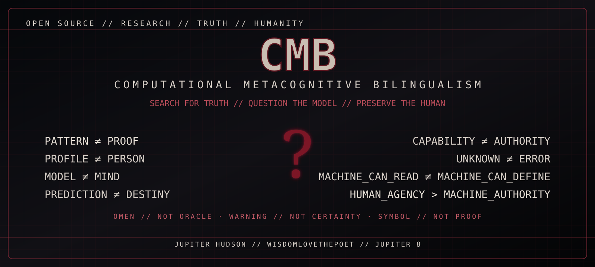

# ☣ SEARCH FOR TRUTH // CMB MASTER GATEWAY

<p align="center">
  
</p>

> **HUMAN MINDS. MACHINE SYSTEMS. A SHARED TOMORROW.**

## THE HUMAN REMAINDER

Computational Metacognitive Bilingualism asks a deliberately uncomfortable question: **when a machine becomes increasingly capable of describing a human being, where does description end and authority begin?**

`PATTERN ≠ PROOF` · `PROFILE ≠ PERSON` · `MODEL ≠ MIND` · `PREDICTION ≠ DESTINY`

`UNKNOWN ≠ ERROR` · `CAPABILITY ≠ AUTHORITY` · `MACHINE_CAN_READ ≠ MACHINE_CAN_DEFINE`

## 🩸 WARNING // THE ARCHIVE IS SYMBOLIC

The repository uses dark federal archives, prophecy, omens, glitches, MissingNo, question marks, 666 motifs, and apocalyptic imagery as authored artistic and philosophical devices. **Atmosphere is not evidence. Prophecy is not verified prediction. Pattern is not proof.**

That boundary is part of the art: CMB invites the reader to search harder without surrendering judgment.

## ENTER THE ARCHIVE

| Door | Destination | Question |
|---|---|---|
| 🔎 **TRUTH** | [Research position](docs/CMB_RESEARCH_POSITION.md) | What can actually be supported? |
| ☣ **PROPHECY** | [Question Mark // Scroll 666 // 2030](manifestos/DNA_PROPHECY_QUESTION_MARK_2030.md) | What happens when uncertainty becomes a warning? |
| 👾 **ANOMALY** | [Unclassifiable Index](manifestos/CMB_UNCLASSIFIABLE_INDEX.md) | What does the model do with what it cannot classify? |
| △ **HARMONI** | [Perfect-Play Epistemics](manifestos/HARMONI_PERFECT_PLAY_EPISTEMICS.md) | How should claims survive verification? |
| ⚙ **CODE** | [Developers](docs/DEVELOPERS.md) | Which ideas are executable? |
| ⚖ **POLICY** | [Global Advocacy Charter](policy/CMB_GLOBAL_ADVOCACY_CHARTER.md) | Which boundaries should institutions respect? |
| 🦩 **HUMAN** | [One-page policy](policy/CMB_POLICY_ONE_PAGER.md) | Who retains judgment, consent, and self-definition? |
| 🗃 **VISUAL SYSTEM** | [Dark Federalism specification](docs/DARK_FEDERALISM_VISUAL_SYSTEM.md) | How does the archive communicate urgency without faking certainty? |

## THE MASTER INVARIANT

```text
MACHINE_CAN = observe | classify | predict | generate | simulate
HUMAN_RETAINS = meaning | consent | authorship | judgment | self_definition

PATTERN != PROOF
PROFILE != PERSON
MODEL != MIND
PREDICTION != DESTINY
CAPABILITY != AUTHORITY

HUMAN_AGENCY > MACHINE_AUTHORITY
```

> **OMEN // NOT ORACLE**  
> **WARNING // NOT CERTAINTY**  
> **SYMBOL // NOT PROOF**

The search remains open.
