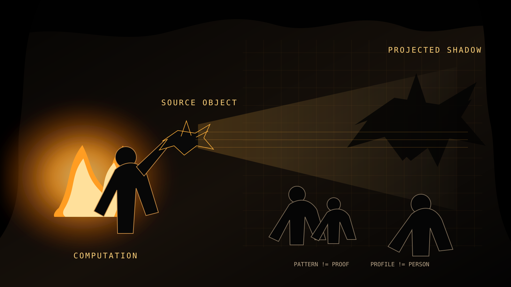

  <section class="shadow-hero" aria-labelledby="shadow-title">
    
    

    

    

      
CMB://ALGORITHMIC_CAVE // PHILOSOPHICAL SYSTEM ACTIVE

      <h1 id="shadow-title">THE SHADOWIS NOTTHE SOURCE</h1>
      
A machine may model the human. <strong>The model does not become the human.</strong>

      

        PATTERN != PROOF
        PROFILE != PERSON
        MODEL != MIND
        PREDICTION != DESTINY
      

    

    <aside class="shadow-thesis">
      <small>THESIS://01</small>
      
Representation can contain information about reality without becoming reality.

      <strong>SHADOW != SOURCE</strong>
    </aside>
  </section>

  <section class="shadow-section shadow-intro">
    
01

    

      
README://WHY_THIS_EXISTS

      <h2>Plato had a cave. <em>We gave it broadband.</em></h2>
      
People once stared at shadows on a wall and mistook representation for reality. We laughed at the story, built global data infrastructure, and then started doing the same thing with profiles, rankings, scores, recommendations, and predictions.

      <blockquote>The shadow can inform you. It must not define you.</blockquote>
    

  </section>

  <section class="shadow-section" id="shadow-comparison">
    
02

    

      
SYSTEM_MAP://OLD_VS_NEW

      <h2>Same category error. <em>More powerful machinery.</em></h2>
      

        <article class="shadow-panel">
          A // PLATO
          <pre><code>OBJECT
  |
LIGHT
  |
SHADOW
  |
OBSERVER
  |
BELIEF</code></pre>
          
The projection changes what the observer believes.

        </article>
        <article class="shadow-panel shadow-panel--hot">
          B // CMB
          <pre><code>HUMAN
  |
DATA
  |
MODEL
  |
PROFILE
  |
PREDICTION
  |
DECISION
  |
HUMAN</code></pre>
          
The projection can now alter what institutions do to the person who generated the data.

        </article>
      

    

  </section>

  <section class="shadow-section" id="shadow-manifesto">
    
03

    

      
<b>cmb://cave_manifesto.py</b>

      

        
$ boot --philosophy=plato --patch=modernity

        
Plato had people staring at shadows and calling them reality.

        
Two thousand years later we said, <strong>"That's ridiculous."</strong>

        
Then we invented analytics dashboards.

        
[SYSTEM] irony detector: OVERHEATING

        
Now a computer watches twelve clicks, measures how long you stared at a sandwich, notices you bought toothpaste at 2:14 AM, and somebody announces:

        
"THE ALGORITHM KNOWS YOU."

        
Knows you? It knows you needed toothpaste. Calm down.

        
Data becomes profile. Profile becomes prediction. Prediction becomes judgment. Pretty soon the spreadsheet has a badge and thinks it is a philosopher.

        
CATEGORY_ERROR:// REPRESENTATION promoted to IDENTITY

      

    

  </section>

  <section class="shadow-section" id="shadow-invariants">
    
04

    

      
CMB://INVARIANTS

      <h2>The firewall is epistemic.</h2>
      

        
<b>PATTERN</b>!=<strong>PROOF</strong>

        
<b>PROFILE</b>!=<strong>PERSON</strong>

        
<b>MODEL</b>!=<strong>MIND</strong>

        
<b>PREDICTION</b>!=<strong>DESTINY</strong>

        
<b>CAPABILITY</b>!=<strong>AUTHORITY</strong>

        
<b>SIMULATION</b>!=<strong>SOVEREIGNTY</strong>

      

    

  </section>

  <section class="shadow-section">
    
05

    

      
BOUNDARY://MACHINE_AND_HUMAN

      <h2>Prediction is information. <em>It is not jurisdiction.</em></h2>
      

        <article class="shadow-panel shadow-machine">
          MACHINE_CAN
          
observe // measure // classify // compare // predict // generate // simulate

        </article>
        <article class="shadow-panel shadow-human">
          HUMAN_RETAINS
          
meaning // consent // authorship // judgment // identity // self-definition // moral agency

        </article>
      

      
HUMAN_AGENCY &gt; MACHINE_AUTHORITY

    

  </section>

  <section class="shadow-section" id="shadow-backtrace">
    
06

    

      
GLITCH://WITNESS_VERIFIED_BACKTRACE

      <h2>Do not worship the projector. <em>Trace the signal.</em></h2>
      <pre><code>SHADOW
  ^
TRACE
  ^
MODEL
  ^
DATA
  ^
SOURCE</code></pre>
      
OBSERVATION != UNDERSTANDINGSIGNAL != SOURCEVERIFIED_LABEL != VERIFIED_TRUTH

      
The observer does not have to reject the shadow. The observer has to understand how the shadow was produced, what was excluded, which assumptions shaped it, and who is permitted to act on it.

    

  </section>

  <section class="shadow-finale">
    
CMB://EXIT_THE_CAVE

    <h2>STUDY THE SHADOW. MEASURE IT. MODEL IT. LEARN FROM IT.</h2>
    
Just do not become stupid enough to worship the projector.

    
THE SHADOW MAY INFORM YOU. <strong>THE SHADOW DOES NOT OWN THE SOURCE.</strong>

    
Force the machine's paper to hold the human's ink.

  </section>

  <footer class="shadow-footer">
    
<strong>Computational Metacognitive Bilingualism (CMB)</strong> // Jupiter Hudson / WisdomLoveThePoet / Jupiter 8

    
This page is philosophy, code-poetry, satire, and systems design. It does not claim that models are useless; it insists that useful inference and human self-definition are different categories.

  </footer>

