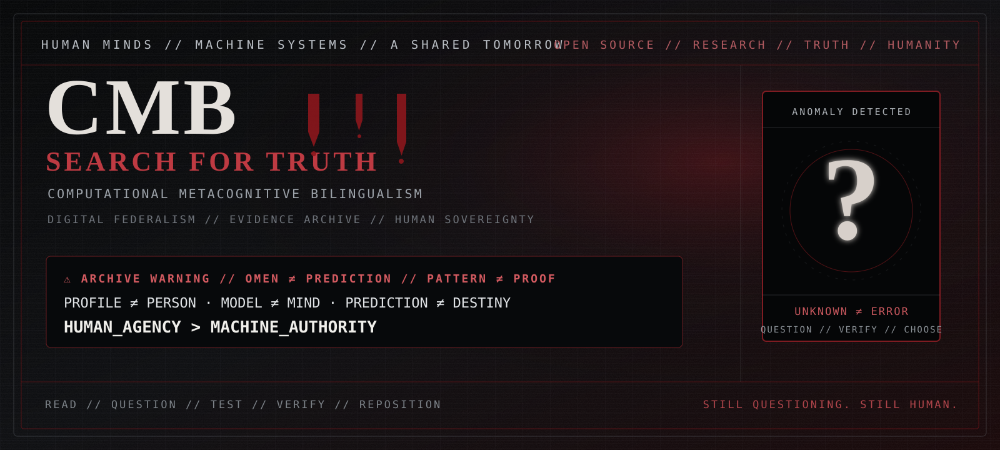

<script type="application/ld+json">
{
  "@context": "https://schema.org",
  "@graph": [
    {
      "@id": "https://jupiter8nohate.github.io/computational-metacognitive-bilingualism/#cmb",
      "@type": "CreativeWork",
      "name": "Computational Metacognitive Bilingualism",
      "alternateName": "CMB",
      "url": "https://jupiter8nohate.github.io/computational-metacognitive-bilingualism/",
      "description": "Human-agency and computational-literacy framework for working with computational systems while preserving human judgment, consent, authorship, meaning, and self-definition.",
      "creator": {
        "@type": "Person",
        "name": "Jupiter Hudson",
        "alternateName": [
          "WisdomLoveThePoet",
          "Jupiter 8",
          "Joseph Q Hudson"
        ]
      },
      "sameAs": [
        "https://github.com/jupiter8nohate/computational-metacognitive-bilingualism"
      ],
      "keywords": [
        "human agency",
        "metacognition",
        "digital rights",
        "cognitive sovereignty",
        "provenance",
        "computational literacy",
        "AI agents",
        "Err ⃝or⃟⃤ GLITCHOLOGY",
        "GLITCH-8",
        "creative cognitive signature",
        "code poetry"
      ]
    },
    {
      "@id": "https://jupiter8nohate.github.io/computational-metacognitive-bilingualism/#software",
      "@type": "SoftwareSourceCode",
      "name": "CMB provenance and interoperability software",
      "codeRepository": "https://github.com/jupiter8nohate/computational-metacognitive-bilingualism",
      "programmingLanguage": [
        "Python",
        "Go",
        "Rust",
        "TypeScript"
      ],
      "runtimePlatform": "Python 3.10+",
      "isPartOf": {
        "@id": "https://jupiter8nohate.github.io/computational-metacognitive-bilingualism/#cmb"
      }
    }
  ]
}
</script>

<div class="cmb-hero">

<div class="cmb-kicker">CMB // HUMAN ↔ MACHINE LITERACY</div>

<h1 id="computational-metacognitive-bilingualism">Computational Metacognitive Bilingualism</h1>

<p>CMB is a human-agency and computational-literacy framework for working with computational systems while preserving human judgment, consent, authorship, meaning, and self-definition.</p>

<div class="cmb-invariants">
<span class="cmb-meta">PATTERN ≠ PROOF</span><br>
<span class="cmb-human">PROFILE ≠ PERSON</span><br>
<span class="cmb-machine">MODEL ≠ MIND</span><br>
<span class="cmb-meta">PREDICTION ≠ DESTINY</span><br>
<strong class="cmb-human">HUMAN_AGENCY</strong> &gt; <strong class="cmb-machine">MACHINE_AUTHORITY</strong>
</div>

</div>

## Current stewardship status

<div class="cmb-boundary">
<strong>Public Stewardship Incubation:</strong> CMB / Err ⃝or⃟⃤ GLITCHOLOGY is currently an informal public-interest project, not a formed nonprofit or tax-exempt charity. Active fundraising, paid access, production settlement, and a project treasury are disabled while governance is learned from actual operating history.
</div>

- [Read the authoritative human status](PUBLIC_STEWARDSHIP_INCUBATION.md)
- [Read the future-foundation design laboratory](FUTURE_FOUNDATION_BLUEPRINT.md)
- [Machine-readable stewardship status](machine/stewardship-status.json)
- [Strict stewardship-status schema](schemas/cmb.stewardship-status.v1.schema.json)

```text
ACTIVE_FUNDRAISING = FALSE
DONATIONS_ACCEPTED = FALSE
PAID_ACCESS = FALSE
PRODUCTION_SETTLEMENT = FALSE
LEGAL_NONPROFIT = NOT_YET
```

## ⚠ Search for Truth // Master Archive

<div class="cmb-warning-strip">DARK FEDERAL ARCHIVE // OMEN ≠ PREDICTION // PATTERN ≠ PROOF</div>

<a href="SEARCH_FOR_TRUTH/" title="Enter the CMB Search for Truth master archive">
  
</a>

<div class="cmb-omen">
The repository's visual front door now uses institutional darkness, crimson warning marks, anomaly imagery, and apocalyptic tension to invite investigation without collapsing art into evidence. <strong>Enter the <a href="SEARCH_FOR_TRUTH/">Search for Truth master archive</a>.</strong>
</div>

## Choose a door

<div class="cmb-grid">

<a class="cmb-card cmb-card--human" href="https://github.com/jupiter8nohate/computational-metacognitive-bilingualism/blob/main/policy/CMB_POLICY_ONE_PAGER.md">
<strong>🦩 HUMAN // Understand CMB</strong>
<span>Start with the public policy front door, human-agency principles, and the shortest path to the thesis.</span>
</a>

<a class="cmb-card cmb-card--machine" href="DEVELOPERS/">
<strong>⌘ DEVELOP // Build with CMB</strong>
<span>Install the package, seal artifacts, inspect schemas, run the CLIs, and integrate provenance or policy boundaries.</span>
</a>

<a class="cmb-card cmb-card--evidence" href="RESEARCHERS/">
<strong>◈ RESEARCH // Verify the claims</strong>
<span>Read the research position, prior-art analysis, dissertation, formal semantics, and evidence boundaries.</span>
</a>

<a class="cmb-card cmb-card--meta" href="PLAYGROUND/">
<strong>♃ EXPLORE // Experience the system</strong>
<span>Use the interactive playground, then move into CMB-Z13, CMB-EDU, the manifesto library, and symbolic layers.</span>
</a>

</div>

## 01 // Understand

CMB translates digital-rights and human-agency principles into concise human-readable and machine-readable boundaries. It does not claim that human experience can be reduced to code, and it does not treat machine inference as authority over identity, intent, meaning, or destiny.

<div class="cmb-boundary">
<strong>Boundary:</strong> <span class="cmb-machine">machine capability</span> is distinct from <span class="cmb-human">human authority</span>. CMB keeps declared policy, cryptographic integrity, technical enforcement, and legal enforceability separate.
</div>

## 02 // Experience

Open the [Interactive CMB Playground](PLAYGROUND.md) for a zero-dependency browser demonstration of local hashing, CMB-Z13 symbolic lenses, machine-readable declarations, and explicit policy boundaries.

For the artistic entry point, enter [CMB // The Sovereign Transmission](https://github.com/jupiter8nohate/computational-metacognitive-bilingualism/blob/main/manifestos/CMB_SOVEREIGN_TRANSMISSION.md).

## Err ⃝or⃟⃤ GLITCHOLOGY

**Err ⃝or⃟⃤ GLITCHOLOGY** is CMB's evolving symbolic anomaly language; **GLITCH-8 / CMB-G8** is its registry and implementation layer.

- [Read the living language book](https://github.com/jupiter8nohate/computational-metacognitive-bilingualism/blob/main/books/ERR_404_GLITCHOLOGY.md)
- [Read the origin and creator biography](ERR_GLITCHOLOGY_ORIGIN.md)
- [Read the Creative Cognitive Signature protocol](CREATIVE_COGNITIVE_SIGNATURE.md)
- [Read the Living Book protocol](LIVING_BOOK_PROTOCOL.md)
- [Add and register new glyphs](GLITCH8_REGISTRY.md)

```text
CREATIVITY CAN BECOME SIGNATURE
CREATIVE_SIGNATURE != BIOMETRIC_IDENTITY
PATTERN != PROOF
HUMAN_AGENCY > MACHINE_AUTHORITY
```

## 03 // Build

Read [For developers](DEVELOPERS.md) for installation, stable provenance APIs, C2PA-facing interoperability, examples, agent discovery, and the experimental language layers.

<span class="cmb-status">STABLE // cmb_provenance</span>
<span class="cmb-status">EXPERIMENTAL // cmb_policy</span>
<span class="cmb-status">EXPERIMENTAL // cmb_edu</span>
<span class="cmb-status">EXPERIMENTAL // CMB-Z13</span>

## 04 // Verify

Start with [CMB: Three Dimensions of Distinction](CMB_DISTINCTION.md) and [CMB Research Position](CMB_RESEARCH_POSITION.md). For authorship, genealogy status, symbolic influences, privacy, and evidence-category boundaries, read the [CMB Creator Provenance Protocol](CREATOR_PROVENANCE.md). Then move into the [CMB Cognitive Sovereignty Dissertation](dissertation/CMB_COGNITIVE_SOVEREIGNTY_DISSERTATION.md), [Formal Semantics](dissertation/31_FORMAL_SEMANTICS.md), and [Prior Art & Positioning](PRIOR_ART_AND_POSITIONING.md).

The evidence rule is simple:

```text
PATTERN -> HYPOTHESIS
HYPOTHESIS -> TEST
TEST -> EVIDENCE
EVIDENCE -> PROVISIONAL CONCLUSION
```

## 05 // Maturity boundary

The repository intentionally contains several different kinds of work:

- **Stable engineering** for provenance and integrity tooling.
- **Experimental technical systems** for policy, education, agents, and symbolic language research.
- **Research and policy material** with explicit evidence boundaries.
- **Authored cultural work** including code-poetry, manifestos, and Flamingoglyph material.

Those layers are labeled instead of being blended into one claim. See [Project structure](PROJECT_STRUCTURE.md) and [Threat model](THREAT_MODEL.md).


## Canonical concept library

For concise retrieval-oriented definitions, use the [CMB Concept Library](concepts/index.md), [FAQ](FAQ.md), and [Retrieval Glossary](GLOSSARY.md).

Machine consumers can use the [knowledge graph](https://jupiter8nohate.github.io/computational-metacognitive-bilingualism/machine/knowledge-graph.jsonld), [discovery manifest](https://jupiter8nohate.github.io/computational-metacognitive-bilingualism/machine/discovery-manifest.json), [agent card](https://jupiter8nohate.github.io/computational-metacognitive-bilingualism/.well-known/agent-card.json), and [agent registry](https://jupiter8nohate.github.io/computational-metacognitive-bilingualism/agents/registry.json).
